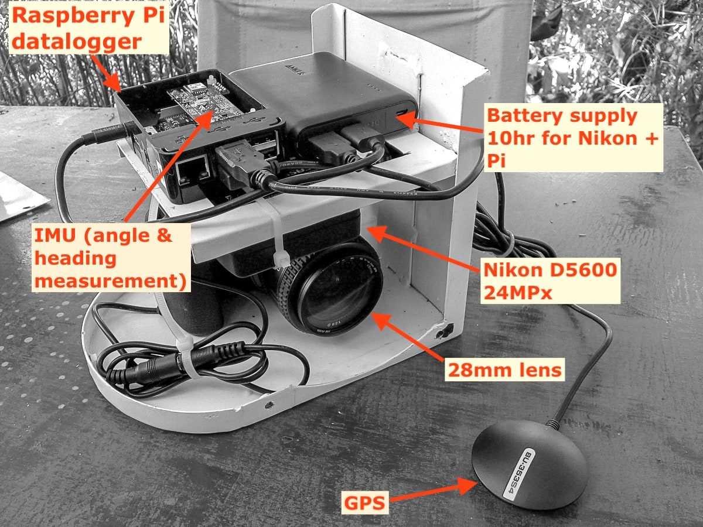

# Lanner CamPod
Oblique aerial photographs of wildlife habitat are at the heart of the MWS wildlife survey system. Some survey implementors have specially modified aircraft which allow cameras to be placed and operated  inside the aircraft cabin, but these modified aircraft are rare and it is extremely difficult and expensive to make modifications to standard aircraft. In 2018 we developed a relatively inexpensive oblique camera system that could be attached to any Cessna 172, 182 or 206 wing strut to get the same field of view as a human observer for a sample count. 

This document outlines the elements and usage of the Lanner camera pod, and suggestions for further development.

*The "Strut Digital Eyeball" in flight over Ruaha National Park, 2018.*

## Aims & mission profile

The requirements of the camera system are to be able to take stable, hi-quality photographs on a continuous basis during flight, ideally with 50% overlap between images, and recording the angles of view to be able to reconstruct the geometry of the photographic footprint.

* Flight duration: 
  * Sample count flight with human observers: 4-5 hours;
  * Photographic-only flight: 4-7 hours.
* Metadata:
  * Camera image with time (subsecond) and general metadata (exposure, ISO, etc);
  * GPS XY and elevation (Z) synchronised via timestamp;
  * Heading, pitch, roll and yaw from IMU;

* Image capture
  * Images should be raw format (Nikon NEF), recorded at a minimum of 2 second intervals or faster;
  * Minimum storage capacity on board should be 1800 frames / hr * 4 hours * 35 MB / frame = 252GB.
  * Aperture set to maximum sharpness for the lens (F7.1 in the case of the f28mm lens);
  * Shutter speed at minimum 1/2000;
  * ISO set as auto-ISO to ensure shutter speed <= 1/2000. 

## Equipment

Each 'pod' consists of:

* DSLR: Nikon D5600 + fixed lens;
* Power system:
    * Tethertools "Case Relay" battery which acts as a sort of uninterruptible power supply, taking power from the battery bank and providing constant power to the camera;
    * USB battery bank, ~ 10,000 mAh;
* Controller / logger: Raspberry Pi 3 (or Zero), connected to:
    * Intertial Measurement Unit: BerryGPS-IMU, which takes readings of all angles and headings;
    * **Optocoupler to trigger camera via cable release port*
    * GPS system:
      * USB GPS, or
      * External GPS antenna attached directly to the BerryGPS-IMU.
* Cables:
    * USB micro from battery bank to raspberry pi;
    * **Shutter release from optocoupler -> camera*
* Housing: steel frame and skin, with screw mount through base for camera and large bolt connector to strut clamp. 

**Not yet implemented*

## Fieldwork so far and lessons learned

### 2018:

Camera pods were trialled in Ruaha-Katavi-Lukwati (RR) and Selous-Mikumi (SL) ecosystems in late 2018 as part of the TAWIRI aerial survey programme. Surveys were primarily funded by WCS and FZS, respectively, and covered 90,000 km² and 110,000 km².

Approximately 200,000 images were collected in RR, and 150,000 in SL.

### 2019:

A set of images was collected in Tarangire National Park with a redesigned housing system, where the camera pod was fitted to a microlight (Savannah) using a two-point attachment system.

For the RR-SL systems, a further 25,000 images were collected in the corridor between the two ecosystems as part of a trial monitoring system for the corridor (for WCS Tanzania).

### Protocol

Ideal protocol follows

1. Anker battery bank was fully charged the evening before. Two bars (out of four) are enough for a whole 4-hour flight, though.
2. Time was set on the camera either manually (from GPS time) or with a USB connection on a laptop. 
3. Pods were attached to the aircraft ~ half an hour before flight. Cameras were set to mimic the field of view of the observer by visual inspection relative to the RSO camera position and the centre of the SRF rods.
   1. In test flights and later flights in SL the cameras were set at 45° angles.
   2. Clamps were left on the wing struts, and the pods slotted into the clamps each time (necessitating angle adjustment).
4. Before closing the housings, the cameras were set to trigger photos ~ 10 minutes after takeoff (enough time to reach closest transects) using the Interval Timer menu:
   1. Start time ~ 0715, but this depended on how close the transects were expected to start and how diligent the team was likely to be about getting into the air on time.
   2. Interval 2 seconds
   3. Number of photos 8000 (enough for 4.4 hours of data collection, which would exceed all but the longest possible collection time)
5. On return, cameras that were still running were manually turned off by reaching in through the porthole. Pods were disconnected from the clamp using the set screw (bolt) and disassembled in the workshop.
6. SD cards were removed from the cameras after flight and data were copied to an external harddrive and later to a backup.

### Performance

* Photographic quality was generally excellent, with easily-distinguishable wildlife down to impala size and smaller. 
* Images had noticable reduced sharpness at the edges at F5-F5.6 (which was the setting for most of the RR images). 
  * This criticism of sharpness is fairly personal, and the PI has been informed that he's being overly picky.
  * Tests determined better sharpness with aperture at F7.1, and later images were set accordingly. This results in 
  * A better lens is needed - turns out this one (Nikkor 28mm) is not known as being terribly sharp. However, it's unsure if a decent combination of small size, focal length and good sharpness is possible. The Sigma Art 28mm is incredibly good but  larger in length, overall volume and weight.
* Auto-ISO settings with 1/2000 speed and any allowable ISO up to 25,600 meant motion blur was unnoticable. The higher ISO values - particularly in the early morning, had a lot of noise, but by the time the target area was 
* The combination of fast shutter speed and the rubber mounts on the connector from housing to clamp seem to have reduced any significant vibration as well, compared to the results that Richard Lamprey reports from a fixed (steel-on-steel) mount from Tsavo.
* The Anker battery in line with the TT for the Nikon is enough to power > 10K shots on the D5600. However, several times the pod returned with the the Anker still full and the TT empty, having captured ~ 3K images before the TT was low. Apparently the TT gets a full charge then stops drawing power, at which point the Anker turns itself off and the TT runs down. 
  * *This is prevented by having the RPi attached at the same time, which ensures enough current draw to keep the Anker on line.*
* Time stamps for the IMU data were not correct until a software update was made for the Selous work. The RPi is supposed to set its internal clock from the GPS signal but this was not working (in Ruaha-Msembe we had wifi which the Pi units were connecting to and getting time info, and this obscured the fact that the NMEA signal wasn't working for the `ntp` function). **Angle information is not necessarily correct for any of the first sets of images collected.**
* GPS data were logged to NMEA files, and the USB GPS units seemed to function within a minute or two of boot.
* Copying image data from the SD cards to hard drives was tedious and something of a limiting factor. With 7-8,000 images collected per flight, typically 150GB of data needed to be copied, and this took > 1 hour per SD card. 

## Optimisations / development

* Time management for the RPi and camera are vital, and there are shortcomings and uncertainties:
  * How can the NMEA (GPS) time setting be made more reliable? How poorly does it actually work?
  * How much drift is there in the clock during survey flights?
  * How accurate is a timestamp logged to a file when it comes from the GPS? Or recording a 'trigger' action on the camera? Is there a large latency in the USB or GPIO system?
  * **How does the timestamp of IMU data relate to the timestamp of the GPS log?**
* RPi should probably log NMEA and IMU data to a single database (SQLite?) - unless just logging to a text file is more robust?
* Communication between the camera and RPi are needed:
  * GPIO trigger of shutter instead of relying on the timing system;
  * Log data collected from USB at some frequency - battery level / storage status in particular.
* Communication with an Android phone is needed, giving:
  * Status of storage on phone, battery level, state of photo capture.
  * Control of triggering and interval options.

